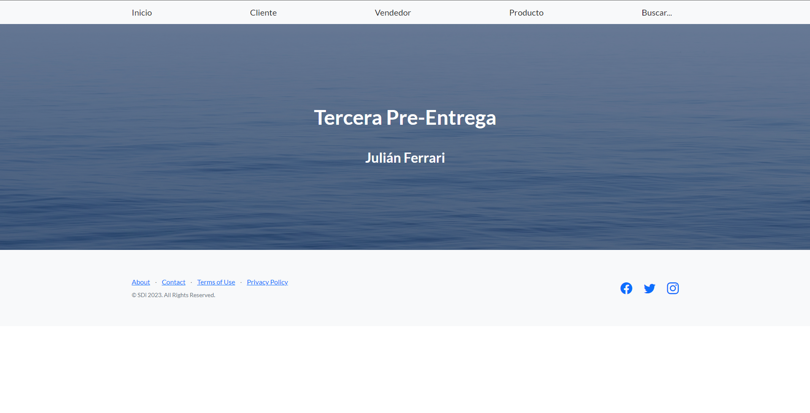

# Tercera-pre-entrega-Ferrari

**Es indistinto el orden para probar las funcionalidades en la seccion de Inicio, Cliente, Vendedor y Producto**

*Sin embargo, para buscar un producto, se debe agregar alguno a la base de datos, como ejemplo esta "Iphone 7"*

